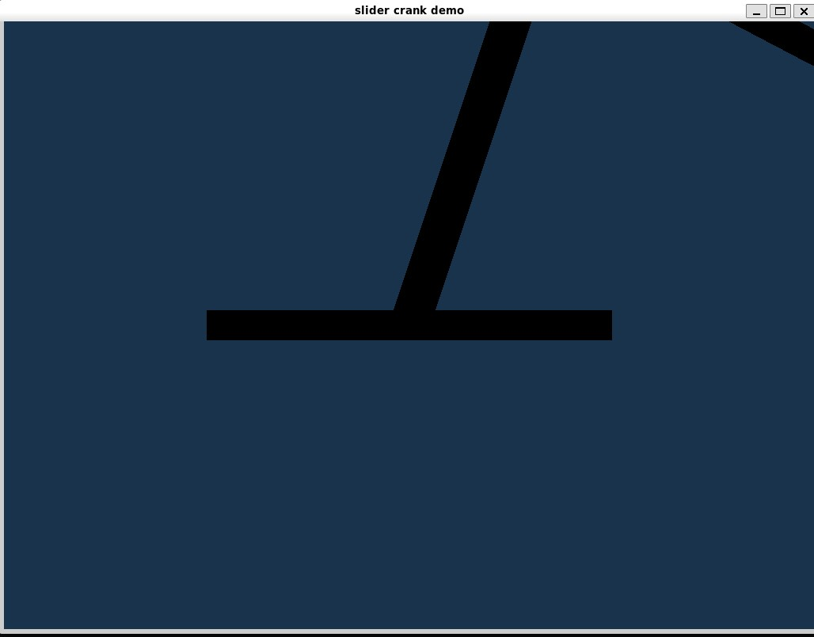

__Problems 6.1, 6.2, 6.3__
Codes are attached.
Check out my GitHub as well: [https://github.com/bclaas/me751/tree/main](https://github.com/bclaas/me751/tree/main)

__Problem 6.4__
Chrono VSG graphics don't render correctly on my computer / WSL (emailed about it last weekend).

Best screenshot I got:

Answering the questions best I can based on the code:
__(2)__
Bodies (and roles)
- Ground: fixed base (a thin box, 1.0×0.1×1.0). Role: inertial reference / anchor for the first joint.
- Crank (link 1): box of length √2, initially at (0.5, 0.5, 0) and rotated +π/4 about z. Role: first pendulum link driven at its base.
- Rod (link 2): box of length 2, initially at (√3/2 + 1, 0.5, 0) and rotated −π/6 about z. Role: second pendulum link connected to the crank.

__(3)__
Joints (how many, which bodies)
2 joints total:
- Revolute speed motor between ground ↔ crank, joint frame at (0, 0, 0).
- Revolute joint between crank ↔ rod, joint frame at (1, 1, 0).

__(4)__
Actuation (what and where)
- Type: a prescribed angular speed (motion driver), not an applied force/torque. Implemented with ChLinkMotorRotationSpeed using a constant function ω = π rad/s.
- Applied between: ground and crank at the base revolute (the motor enforces relative speed at that joint).
