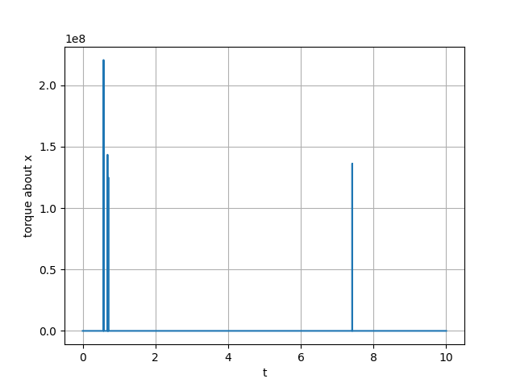
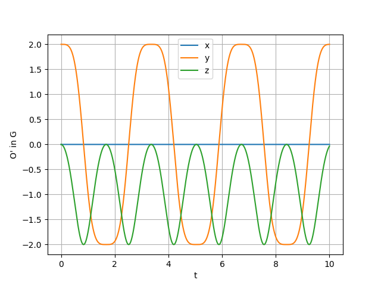
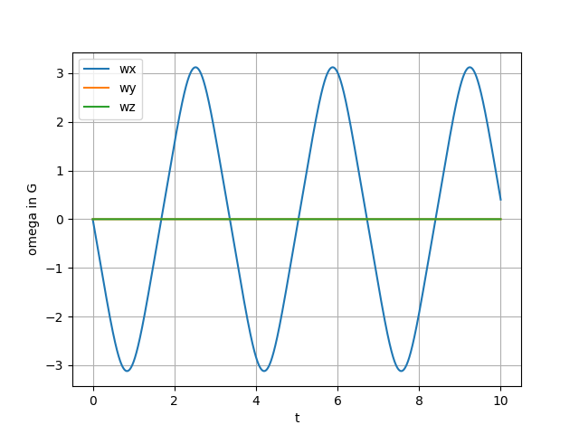
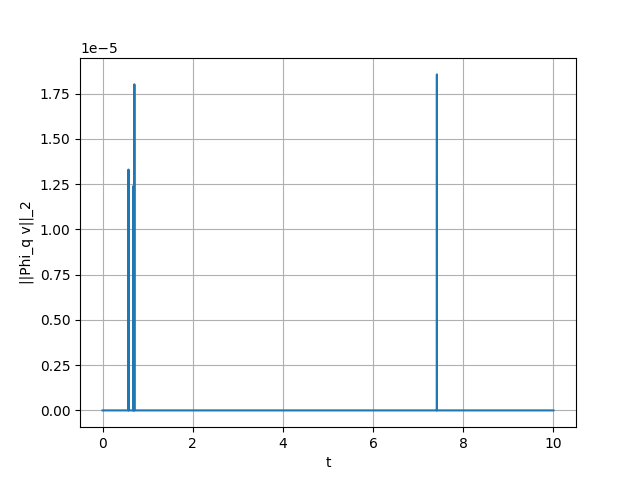
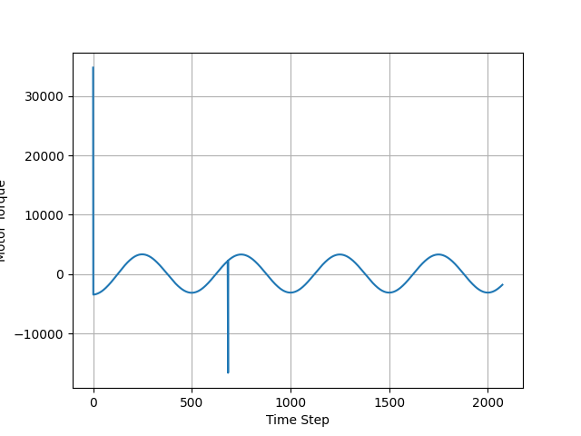

__Problem 7.1__
See attached `program7-1.py`

Step size = 0.001
Time = 12.94987

__Problem 7.2__
__Solution(s)__
__(a)__
B3-24 is a 2-node, 3D ANCF beam element. Each node carries:
- **\(\mathbf{r}\)** — position (3 components),
- **\(\mathbf{r}_{,u}\), \(\mathbf{r}_{,v}\), \(\mathbf{r}_{,w}\)** — position gradients w.r.t. the element’s local coordinates \(u,v,w\) (each a 3-vector).

Total DOFs: \(2 \text{ nodes} \times (1+3) \text{ vectors} \times 3 = 24\).

__(b)__
Let
\[
N(t)=\big[\;\mathbf{r}_1\;\; \mathbf{r}_{1,u}\;\; \mathbf{r}_{1,v}\;\; \mathbf{r}_{1,w}\;\; 
\mathbf{r}_2\;\; \mathbf{r}_{2,u}\;\; \mathbf{r}_{2,v}\;\; \mathbf{r}_{2,w}\;\big]
=\big[\; \mathbf{e}_1\;\mathbf{e}_2\;\mathbf{e}_3\;\mathbf{e}_4\;\mathbf{e}_5\;\mathbf{e}_6\;\mathbf{e}_7\;\mathbf{e}_8 \big].
\]
With scalar shape functions \(s_i(u,v,w)\),
\[
\mathbf{r}(u,v,w,t)=N(t)\,s(u,v,w)=\sum_{i=1}^{8}\mathbf{e}_i(t)\,s_i(u,v,w).
\]

__(c)__
Let \(\xi := u/L = u/10 \in [0,1]\). Use cubic Hermite in the axial coordinate and linear dependence in \(v, w\):
\[
\begin{aligned}
h_1(\xi)&=1-3\xi^2+2\xi^3, &\quad
h_2(\xi)&=\xi-2\xi^2+\xi^3,\\
h_3(\xi)&=3\xi^2-2\xi^3, &\quad
h_4(\xi)&=-\xi^2+\xi^3.
\end{aligned}
\]
The eight scalar shape functions are
\[
\begin{aligned}
s_1 &= h_1,          &\quad s_2 &= L\,h_2, &\quad s_3 &= v\,h_1, &\quad s_4 &= w\,h_1,\\
s_5 &= h_3,          &\quad s_6 &= L\,h_4, &\quad s_7 &= v\,h_3, &\quad s_8 &= w\,h_3.
\end{aligned}
\]
These enforce at \(u=0\): \(\mathbf{r}=\mathbf{r}_1,\ \mathbf{r}_{,u}=\mathbf{r}_{1,u},\ \mathbf{r}_{,v}=\mathbf{r}_{1,v},\ \mathbf{r}_{,w}=\mathbf{r}_{1,w}\), and similarly at \(u=L\) for node 2. For the cross-section, \(v\in[-W/2,W/2]=[-0.5,0.5]\), \(w\in[-H/2,H/2]=[-0.5,0.5]\).

__(d)__
Define \(H\in\mathbb{R}^{8\times 3}\) by rows \(i=1,\dots,8\): \([\,s_{i,u}\;\; s_{i,v}\;\; s_{i,w}\,]\). 
Using \(\partial/\partial u=(1/L)\,d/d\xi\) with \(L=10\) and
\[
h_1'=-6\xi+6\xi^2,\quad
h_2'=1-4\xi+3\xi^2,\quad
h_3'=6\xi-6\xi^2,\quad
h_4'=-2\xi+3\xi^2,
\]
the entries are
\[
\begin{array}{lll}
s_{1,u}=0.1\,h_1', & s_{1,v}=0,    & s_{1,w}=0,\\[2pt]
s_{2,u}=h_2',      & s_{2,v}=0,    & s_{2,w}=0,\\[2pt]
s_{3,u}=0.1\,v\,h_1', & s_{3,v}=h_1, & s_{3,w}=0,\\[2pt]
s_{4,u}=0.1\,w\,h_1', & s_{4,v}=0,   & s_{4,w}=h_1,\\[2pt]
s_{5,u}=0.1\,h_3', & s_{5,v}=0,    & s_{5,w}=0,\\[2pt]
s_{6,u}=h_4',      & s_{6,v}=0,    & s_{6,w}=0,\\[2pt]
s_{7,u}=0.1\,v\,h_3', & s_{7,v}=h_3, & s_{7,w}=0,\\[2pt]
s_{8,u}=0.1\,w\,h_3', & s_{8,v}=0,   & s_{8,w}=h_3.
\end{array}
\]

The deformation gradient used in the element kinematics is \(F(u,v,w,t)=N(t)\,H(u,v,w)=\sum_{i=1}^8 \mathbf{e}_i(t)\,\nabla s_i(u,v,w)\).
"""

__Problem 7.3__
__Solution(s)__
__(a)__
S3-44 is a 4-node, 3D shell (ANCF-style) element. Each corner node carries **four vector nodal unknowns**:
- **\(\mathbf{r}\)** — position (3 components),
- **\(\mathbf{r}_{,u}\)** — position gradient w.r.t. the element’s local \(u\) coordinate (3 components),
- **\(\mathbf{r}_{,v}\)** — position gradient w.r.t. the element’s local \(v\) coordinate (3 components),
- **\(\mathbf{r}_{,uv}\)** — mixed position gradient (cross-derivative) w.r.t. \(u\) and \(v\) (3 components).

Total DOFs: \(4 \text{ nodes} \times 4 \text{ vectors/node} \times 3 = 48\).

The thickness direction \(w\in[-H/2,H/2]\) is included for integration; the interpolation below depends on \(u,v\) (surface) and is independent of \(w\).

__(b)__
Number the four corner nodes in the \((u,v)\) parent domain as
\((0,0)\rightarrow \text{node }1,\ (L,0)\rightarrow \text{node }2,\ (L,W)\rightarrow \text{node }3,\ (0,W)\rightarrow \text{node }4\).
Let the vector of time-dependent unknowns be
\[
N(t)=\big[\,\mathbf{r}_1\ \mathbf{r}_{1,u}\ \mathbf{r}_{1,v}\ \mathbf{r}_{1,uv}\ \mathbf{r}_2\ \mathbf{r}_{2,u}\ \mathbf{r}_{2,v}\ \mathbf{r}_{2,uv}\ \mathbf{r}_3\ \mathbf{r}_{3,u}\ \mathbf{r}_{3,v}\ \mathbf{r}_{3,uv}\ \mathbf{r}_4\ \mathbf{r}_{4,u}\ \mathbf{r}_{4,v}\ \mathbf{r}_{4,uv}\,\big]
=\big[\,\mathbf{e}_1\ \mathbf{e}_2\ \dots\ \mathbf{e}_{16}\,\big].
\]
With scalar shape functions \(s_i(u,v,w)\), the interpolation is
\[
\mathbf{r}(u,v,w,t)=N(t)\,s(u,v,w)=\sum_{i=1}^{16}\mathbf{e}_i(t)\,s_i(u,v,w).
\]

__(c)__
Introduce normalized coordinates \(\xi:=u/L=u/10\in[0,1]\) and \(\eta:=v/W=v/10\in[0,1]\). 
Use **tensor-product Hermite** polynomials in \(\xi\) and \(\eta\):
\[
\begin{aligned}
h_1(\xi)&=1-3\xi^2+2\xi^3,&\quad h_2(\xi)&=\xi-2\xi^2+\xi^3,\\
h_3(\xi)&=3\xi^2-2\xi^3,&\quad h_4(\xi)&=-\xi^2+\xi^3,\\
g_1(\eta)&=1-3\eta^2+2\eta^3,&\quad g_2(\eta)&=\eta-2\eta^2+\eta^3,\\
g_3(\eta)&=3\eta^2-2\eta^3,&\quad g_4(\eta)&=-\eta^2+\eta^3.
\end{aligned}
\]

At each node we associate four scalar shape functions multiplying the nodal sets \(\{\mathbf{r},\mathbf{r}_{,u},\mathbf{r}_{,v},\mathbf{r}_{,uv}\}\).
Using the standard Hermite scaling, the sixteen \(s_i\) are

**Node 1 at \((\xi,\eta)=(0,0)\):**
\[
\boxed{
\begin{aligned}
s_1 &= h_1 g_1,\\
s_2 &= L\,h_2 g_1,\\
s_3 &= W\,h_1 g_2,\\
s_4 &= L W\,h_2 g_2.
\end{aligned}}
\]

**Node 2 at \((1,0)\):**
\[
\boxed{
\begin{aligned}
s_5  &= h_3 g_1,\\
s_6  &= L\,h_4 g_1,\\
s_7  &= W\,h_3 g_2,\\
s_8  &= L W\,h_4 g_2.
\end{aligned}}
\]

**Node 3 at \((1,1)\):**
\[
\boxed{
\begin{aligned}
s_9  &= h_3 g_3,\\
s_{10} &= L\,h_4 g_3,\\
s_{11} &= W\,h_3 g_4,\\
s_{12} &= L W\,h_4 g_4.
\end{aligned}}
\]

**Node 4 at \((0,1)\):**
\[
\boxed{
\begin{aligned}
s_{13} &= h_1 g_3,\\
s_{14} &= L\,h_2 g_3,\\
s_{15} &= W\,h_1 g_4,\\
s_{16} &= L W\,h_2 g_4.
\end{aligned}}
\]

These satisfy the Kronecker properties at the corners and enforce the prescribed first and mixed derivatives in \(u\) and \(v\). The interpolation is independent of \(w\); thickness \(H=0.1\) affects integration limits, not the \(s_i\) themselves.

__(d)__
Let \(H\in\mathbb{R}^{16\times 3}\) stack the gradients \([\,s_{i,u}\ \ s_{i,v}\ \ s_{i,w}\,]\) row-wise. Using
\[
\frac{\partial}{\partial u}=\frac{1}{L}\frac{\partial}{\partial \xi}=\tfrac{1}{10}\frac{\partial}{\partial \xi},\qquad
\frac{\partial}{\partial v}=\frac{1}{W}\frac{\partial}{\partial \eta}=\tfrac{1}{10}\frac{\partial}{\partial \eta},\qquad
\frac{\partial}{\partial w}=0,
\]
and the 1D derivatives
\[
\begin{aligned}
h_1'&=-6\xi+6\xi^2,&\ h_2'&=1-4\xi+3\xi^2,&\ h_3'&=6\xi-6\xi^2,&\ h_4'&=-2\xi+3\xi^2,\\
g_1'&=-6\eta+6\eta^2,&\ g_2'&=1-4\eta+3\eta^2,&\ g_3'&=6\eta-6\eta^2,&\ g_4'&=-2\eta+3\eta^2,
\end{aligned}
\]
the nonzero entries are obtained by product rule. For example,
\[
\begin{aligned}
s_{1,u}&=\tfrac{1}{10}\,h_1' g_1, & s_{1,v}&=\tfrac{1}{10}\,h_1 g_1', & s_{1,w}&=0,\\
s_{2,u}&=h_2' g_1,               & s_{2,v}&=\tfrac{1}{10}\,L\,h_2 g_1'=\tfrac{1}{10}\,10\,h_2 g_1'=h_2 g_1', & s_{2,w}&=0,\\
s_{3,u}&=\tfrac{1}{10}\,W\,h_1' g_2=h_1' g_2, & s_{3,v}&=\tfrac{1}{10}\,W\,h_1 g_2'=h_1 g_2', & s_{3,w}&=0,\\
s_{4,u}&=W\,h_2' g_2,            & s_{4,v}&=L\,h_2 g_2',            & s_{4,w}&=0,
\end{aligned}
\]
and similarly for \(s_5,\dots,s_{16}\) by replacing \((h_1,h_2)\) with \((h_3,h_4)\) when \(\xi\) is anchored at 1, and \((g_1,g_2)\) with \((g_3,g_4)\) when \(\eta\) is anchored at 1. Thus
\[
H(u,v,w)=\begin{bmatrix}
s_{1,u} & s_{1,v} & 0\\
\vdots  & \vdots  & \vdots\\
s_{16,u} & s_{16,v} & 0
\end{bmatrix}.
\]

__Problem 7.3__

