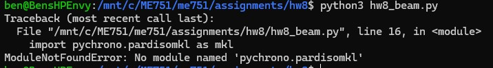

__Problem 8.1__
__(a)__
Mass matrix size: 24×24. why: B3-24 has 8 nodal unknowns and each is a 3-vector → 8×3 = 24 generalized DOFs.

mass matrix values (this clamped beam, consistent TL mass): form is M = kron(m_ij, I3). below is the 8×8 scalar matrix m_ij in kg:
row1: 1.28700e-02 9.07500e-04 0.00000e+00 0.00000e+00 4.45500e-03 -5.36250e-04 0.00000e+00 0.00000e+00
row2: 9.07500e-04 8.25000e-05 0.00000e+00 0.00000e+00 5.36250e-04 -6.18750e-05 0.00000e+00 0.00000e+00
row3: 0.00000e+00 0.00000e+00 8.66250e-09 0.00000e+00 0.00000e+00 0.00000e+00 4.33125e-09 0.00000e+00
row4: 0.00000e+00 0.00000e+00 0.00000e+00 8.66250e-09 0.00000e+00 0.00000e+00 0.00000e+00 4.33125e-09
row5: 4.45500e-03 5.36250e-04 0.00000e+00 0.00000e+00 1.28700e-02 -9.07500e-04 0.00000e+00 0.00000e+00
row6: -5.36250e-04 -6.18750e-05 0.00000e+00 0.00000e+00 -9.07500e-04 8.25000e-05 0.00000e+00 0.00000e+00
row7: 0.00000e+00 0.00000e+00 4.33125e-09 0.00000e+00 0.00000e+00 0.00000e+00 8.66250e-09 0.00000e+00
row8: 0.00000e+00 0.00000e+00 0.00000e+00 4.33125e-09 0.00000e+00 0.00000e+00 0.00000e+00 8.66250e-09

Gauss–legendre points for exact volume integrals in the mass matrix: Ou = 4, Ov = 2, Ow = 2.

M is computed once per element. Reason: in total-lagrangian form the consistent mass depends only on reference geometry, density, and shape functions; clamping/deformation doesn’t change it.

__(f)__
Honestly, this assignment was a struggle. I felt like individual concepts (Material Models, Elements, shape functions, etc.) were understandable in themselves but it was not clear what the order-of-operations was in the computations.

__Problem 8.2__

I couldn't actually do it - but as damping increases, amplitude and frequency will decrease.